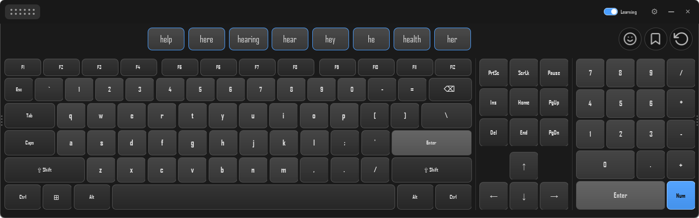
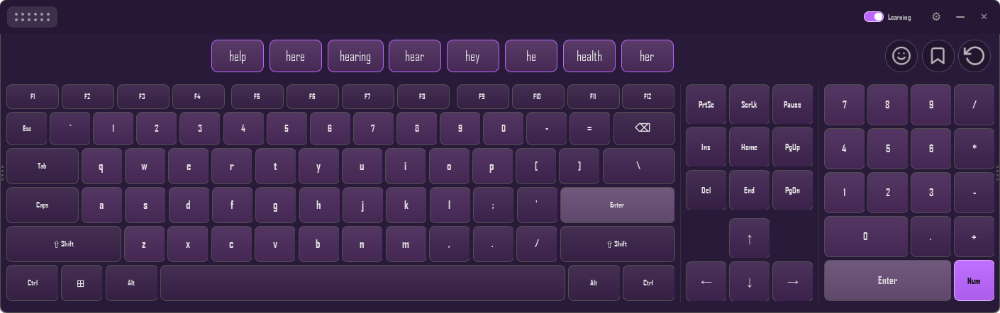
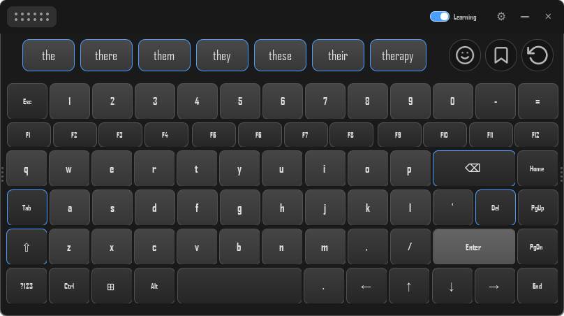
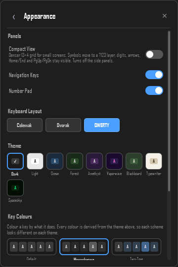
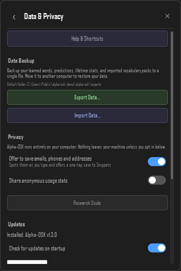
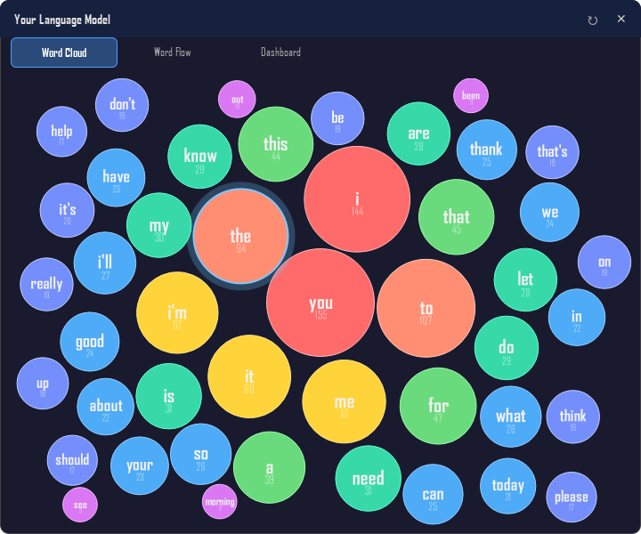
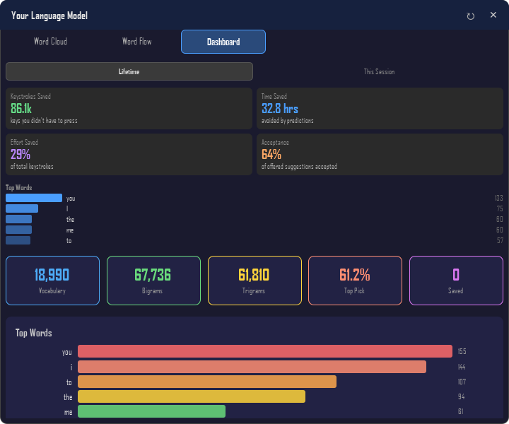
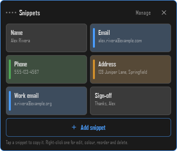

<div align="center">


# Alpha-OSK

**The smartest keyboard you'll never touch.**

Type into any Windows or Linux app by clicking on-screen keys. Built for people who can't comfortably use a physical keyboard. Prediction that learns as you go, with no LLM, no GPU, and nothing leaving your machine. Optional voice dictation is the one exception, and it is off until you turn it on.

[](LICENSE)
[](https://github.com/owenpkent/alpha-osk/actions/workflows/ci.yml)
[](tests/)
[](https://github.com/okstudio1/alpha-osk-releases/releases)



</div>

---

## Pick your path

<table>
<tr>
<td width="33%" valign="top">

### 🪶 I want to use it

You can't use a physical keyboard comfortably, or you're setting it up for someone who can't.

**Jump to** [Install](#install) and then [First launch](#first-launch).

</td>
<td width="33%" valign="top">

### 🔧 I want to read or fork the code

You're a developer evaluating Alpha-OSK as a reference, a contributor, or someone porting a piece of it to your own tool.

**Jump to** [Architecture](#architecture) and [`CLAUDE.md`](CLAUDE.md) for the codebase map.

</td>
<td width="33%" valign="top">

### 📐 I want to evaluate the engineering

You're a hiring manager, reviewer, or accessibility researcher checking the rigour of the project.

**Jump to** the [white paper](docs/WHITEPAPER.md), [Status](#status), and [Reliability](#reliability).

</td>
</tr>
</table>

---

## What it is

Alpha-OSK is an on-screen keyboard for Windows and Linux. You click keys in the keyboard window to type into whatever other application has focus: editor, browser, terminal, chat client, even a game or a remote-desktop session. The keyboard never steals focus from the app you're typing into, stays above other windows, and remembers its size and position between sessions.

As you click, the keyboard learns your vocabulary and surfaces predictions as clickable pills above the keys. Accept a pill to skip the rest of the word. Right-click a pill to teach the keyboard your preferences. Prediction and learning run entirely on your machine: no model upload, no cloud round-trip, no LLM. Optional voice dictation is the single feature that sends anything out, it is off by default, and it needs a recogniser API key of your own before it does anything at all. The project exists because the author is a wheelchair user with muscular dystrophy and the keyboards shipped with Windows and Linux are inadequate for daily use. Every design decision in here is grounded in that constraint.

## Install

### End users

Download the latest installer from the public releases repo:

**[github.com/okstudio1/alpha-osk-releases](https://github.com/okstudio1/alpha-osk-releases/releases)**

| Platform | File | Notes |
|----------|------|-------|
| Windows  | `Alpha-OSK-Setup-X.Y.Z.exe` | EV-signed, includes auto-update. Runs the installer; the keyboard appears on first launch. |
| Linux    | `Alpha-OSK-X.Y.Z-x86_64.AppImage` | Unsigned by design. `chmod +x` and run. Needs `xdotool` (X11) or `ydotool` (Wayland) installed at the OS level. |
| macOS    | In progress | Tracked in [`docs/build/MACOS.md`](docs/build/MACOS.md). Synthesiser and window flags scaffolded; code-signing and notarisation still to do. |

> **First launch on Windows:** you may see a blue "Windows protected your PC" screen. This is normal for newer apps and does not mean anything is wrong. Alpha-OSK is digitally signed by **OK Studio Inc.** (click **More info** and you will see that publisher name). Click **More info -> Run anyway** to install. The prompt stops appearing on its own as more people install. (Microsoft removed the SmartScreen fast-pass for signed apps in 2024, so reputation now builds purely from download volume.)

### From source

```bash
git clone https://github.com/owenpkent/alpha-osk.git
cd alpha-osk
python run.py
```

`run.py` creates a venv, installs PySide6 and dependencies, and launches the keyboard. Windows uses the Win32 SendInput API directly. Linux needs `xdotool` or `ydotool` at the OS level.

## First launch

After the keyboard window appears:

1. **Click into the app you want to type into.** The on-screen keyboard floats above other windows but never takes focus. Whatever app you click last is where your keystrokes go. Open a Notepad or browser tab to try it.
2. **Click letters on the keyboard.** They appear in the focused app exactly as a physical keypress would. Try typing a sentence.
3. **Watch the pills above the keys.** After a few characters, prediction pills appear. Click any pill to insert the rest of that word plus a space. The longer you use the keyboard, the better the predictions get.
4. **Move the window.** Drag the dark title bar at the top to reposition. Drag either left or right edge to resize the width; height auto-fits content.
5. **Open settings.** The ⚙ icon in the top-right opens a drill-down menu. Change theme, switch layout (QWERTY / Dvorak / Colemak), turn Compact View on for a denser keyboard, toggle the function row, navigation cluster, or numpad, adjust opacity, and more.
6. **Pause learning.** The **Learning** switch in the title bar toggles whether the keyboard updates its model from what you type. Password fields auto-pause learning automatically.

That covers ~90% of day-to-day use. The rest of this README and the [white paper](docs/WHITEPAPER.md) cover the depth.

## Screenshots

<div align="center">



*Amethyst theme. Nine themes ship in total: Dark, Light, Ocean, Forest, Amethyst, Vaporwave, Blackboard, Typewriter, Spaceship.*



*Compact View: a denser 13x4 grid for small screens, with digits on their own panel and symbols one tap away on `?123`. The editing keys are accent-tinted because a uniform grid gives no size cue to find them by.*

<table>
<tr>
<td width="50%" align="center">

<br /><em>Appearance: Compact View plus the function row, navigation, and numpad panel toggles; pick QWERTY / Dvorak / Colemak; pick a theme; adjust opacity.</em>
</td>
<td width="50%" align="center">

<br /><em>Data & Privacy: one-click export and import of your model, lifetime stats, and vocabulary packs; opt-in anonymous telemetry; auto-update.</em>
</td>
</tr>
<tr>
<td width="50%" align="center">

<br /><em>Your Language Model, Word Cloud tab: a bubble chart of your learned vocabulary, sized by frequency. Click any bubble to drill into what comes before and after that word.</em>
</td>
<td width="50%" align="center">

<br /><em>Dashboard: lifetime keystrokes saved, time saved, effort saved, and acceptance rate. Plus top words and vocabulary, bigram, and trigram counts.</em>
</td>
</tr>
</table>



*Snippets: text you type constantly, one tap from the clipboard. Tap a tile to copy it and paste it wherever you need; right-click one to edit it, tag it a colour, reorder it or delete it. It floats as its own window so you can drag it anywhere, and Alpha-OSK can offer to fill these in for you when it spots an email, phone number or address as you type.*

</div>

> The screenshots above are generated by [`scripts/capture_screenshots.py`](scripts/capture_screenshots.py), which drives the real QML against a sandboxed config directory and a demo vocabulary. Nothing in them is anybody's actual typing.

## FAQ

**My keys aren't appearing in Slack, Discord, VS Code, or a game.**
Open Settings → Smart Typing → Input and set Compatibility Mode to "Always On" for that session. Auto-detect is on by default and covers VS Code, JetBrains IDEs, TeamViewer, RDP, VNC, and AnyDesk, but anything else may need the manual override. Compat mode swaps suffix-only insertion for backspace-then-retype, which is slower but survives apps that intercept keystrokes for autocomplete or remote forwarding.

**Predictions are wrong, capitalised oddly, or showing fragments.**
Right-click any pill. "Show less" downweights it, "Remove" suppresses it entirely, "Edit" lets you fix capitalisation (e.g. `iphone` → `iPhone`). Suppressed words auto-rehabilitate after you type them manually three times, so a regrettable suppression is recoverable. Right-clicking a *good* pill marks it preferred and bumps its weight by 5.

**How do I move the keyboard?**
Drag the dark title bar at the top. The window stays above other apps but doesn't take focus, so dragging it doesn't interrupt whatever you were typing.

**How do I resize?**
Drag either the left or right edge. Width is the only knob; height auto-fits the keyboard content (no vertical resize handle, because slow-motion edge resizes lose precision).

**How do I pause learning?**
Flip the **Learning** switch in the title bar off. Keystrokes still reach the OS but never enter the prediction model, and the suggestion bar reads "Learning paused" so the state is never ambiguous. Password fields pause learning automatically (Windows UI Automation on Windows, AT-SPI on Linux).

**How do I change the theme?**
Settings ⚙ → Appearance → Theme. Nine choices including Blackboard for high contrast. Theme also affects prediction pills, the navigation panel, and the numpad so the whole surface stays coherent.

**How do I make the keyboard see through to what's behind it?**
Settings ⚙ → Appearance → Sound & Opacity → Opacity slider.

**Where does my data live?**
Windows: `%APPDATA%\alpha-osk\`. Linux: `~/.config/alpha-osk/`. The model files are `models/ngram_model.json` and `models/ppm_model.json`. Lifetime stats are in `analytics.json`, saved snippets in `snippets.json`, and dictation settings in `dictation.json`. Settings → Data & Privacy → Data Backup writes all of it (plus any imported vocabulary packs) to a single `.zip` you can move between machines.

**Does any of this send my typing to a server?**
Your typing, no. Your voice, only if you switch on Dictation and supply your own Deepgram API key: while the microphone is open that audio goes to Deepgram to be transcribed, and at no other time. Dictation is off by default and inert without a key. See [`docs/PRIVACY.md`](docs/PRIVACY.md).

Nothing else leaves the machine on its own. The opt-in anonymous-stats client is wired into the app but `DEFAULT_ENDPOINT` is currently the empty string, so the client silently no-ops every submission attempt regardless of the toggle. When the endpoint is deployed in a future release, opting in would send nine integer counters per week (lifetime keystroke count, words typed, predictions used, etc.) plus a random UUID. Never content, word frequencies, key frequencies, IP, or hostname. See [`docs/PRIVACY.md`](docs/PRIVACY.md).

**Something went wrong. What should I send with the bug report?**
The diagnostic log. **Settings > Data & Privacy > Diagnostics** has **Open Log Folder** and **Copy Path**; the file is `alpha-osk.log` in your config directory. It records errors and crashes, including the full traceback if the app falls over, and never records what you type.

**Can I import my own vocabulary?**
Yes. Settings → Your Language Model → Vocabulary Packs → Import Custom Pack. A pack is a folder containing `dictionary.txt` (one word per line) and optionally `bigrams.txt`, `trigrams.txt`, and `pack.json`. No built-in packs ship; the rationale is in the white paper.

**Can it type emoji and non-Latin characters?**
Yes on Windows (Unicode keystroke injection covers anything in BMP and supplementary planes). On Linux the AppImage relies on whatever your `xdotool` / `ydotool` build supports; Unicode injection works in most desktop setups.

## Status

| Area | State |
|------|-------|
| Core keyboard (Windows + Linux) | Shipping |
| Hybrid prediction engine | Shipping |
| Custom vocabulary import | Shipping |
| Auto-update (Windows) | Shipping |
| Anonymous telemetry (opt-in) | Client + UI shipped, endpoint not yet deployed |
| Analytics dashboard | Shipping |
| Data backup (export / import) | Shipping |
| Test suite | ~1,900 tests passing |
| macOS port | In progress |
| Federated learning | Designed, not implemented |
| Voice dictation (opt-in, bring your own Deepgram key) | Shipping |

## Features

### Typing

- QWERTY, Dvorak, and Colemak layouts
- Compact View: a denser 13x4 grid for small screens, with digits on their own panel and two symbol pages behind `?123`
- Sticky modifiers (Shift, Ctrl, Alt, Win) with auto-release after the next key, or right-click one to lock it held
- Multi-modifier chords (Win+Shift+S, Ctrl+Alt+Del, etc.)
- Right-click a character key for its shifted variant without flipping sticky shift
- Numpad panel with NumLock toggle between digits and navigation keys
- Intelligent spacing: the auto-space after punctuation stands down inside an email, a link, a decimal, a time, or a file path, instead of breaking it in half
- Snippets for text you type constantly (name, email, address, canned replies), inserted with one tap. Alpha-OSK can spot an email, phone number or address as you type it and offer to save it for you, on your machine only and never while learning is paused

### Voice

- Dictation: click the microphone at the left of the suggestion bar, speak, click again. There is nothing to hold down, which matters if a sustained press is exactly the gesture you cannot make
- What you have said so far shows in the suggestion bar; each finished phrase is typed into whatever app you were already using
- Stops itself after a few seconds of silence, so a click that misses cannot leave the microphone open. Both that delay and a maximum run length are adjustable
- Off by default and inert until you add your own Deepgram API key. Audio is sent only while the microphone is open, never recorded to disk, and a focused password field cancels a run outright (see [Privacy](docs/PRIVACY.md))

### Prediction

- Hybrid n-gram + PPM + fuzzy spatial recognition merged with one of four user-selectable strategies (rank, RRF, linear, log-linear)
- Learns your vocabulary on-device, with backspace as a negative signal
- Learns the things a word model can't hold: your phone number, zip, house number and email address, suggested back by prefix. Typing `@` offers common email domains, and the ones you actually use move to the front. Long digit runs are refused outright so card and Social Security numbers are never stored (see [Privacy](docs/PRIVACY.md))
- Right-click any prediction pill to show more, show less, edit, or remove permanently
- Auto-rehabilitation of suppressed words after 3 manual retypes
- Custom vocabulary pack import for domain dictionaries (medical, programming, etc.)
- Per-keystroke autocorrect surfaced as suggestion pills, never silent overwrites
- Shift and Caps Lock both recase the suggestions live, so the pill you tap arrives capitalised the way you meant it

### Data backup

- Export your model, lifetime stats, and imported vocabulary packs to a single `.zip` file (Settings → Data & Privacy → Data Backup)
- Import on a new machine to restore everything in place. No restart required.
- Import auto-creates a timestamped rescue file of your current state first, so a regrettable import is one click to roll back
- Telemetry contributor ID is deliberately excluded from exports so contributions never link across machines

### Accessibility

- Tunable repeat delay and repeat interval per user
- Compatibility mode for IDEs (VS Code, JetBrains) and remote desktop (TeamViewer, RDP, VNC) where suffix-only insertion is unsafe
- Privacy mode: auto-detects password fields and pauses learning
- Window never steals focus from the app you're typing into
- Nine themes including high-contrast options
- Adjustable opacity, key spacing, key sizing
- Drag-to-resize from either edge (width only; height auto-fits content)

### Reliability

- Single-instance lock prevents accidental duplicates
- About 1,900 tests covering prediction, platform abstraction, bridge, vocab packs, dictation, telemetry, data export,
  including property-based suites that generate adversarial inputs for the archive / pack import
  paths and the prediction-engine invariants
- CI runs ruff + mypy + pytest + OSV CVE scan on every push and PR
- All-time analytics persist across sessions (keystrokes saved, time saved, acceptance rate)
- CycloneDX SBOM and a `pip freeze` lockfile ship alongside every Windows and Linux installer

## Architecture

```
qml/                   Qt Quick UI (Main.qml, keyboard rows, prediction bar, settings)
src/
  keyboard_app.py      QML engine, window flags, OS focus handling
  keyboard_bridge.py   Python <-> QML bridge: keys, modifiers, predictions, context
  platform/            OS abstraction (Linux xdotool/ydotool, Windows SendInput, macOS Quartz)
  prediction/          Hybrid engine: n-gram, PPM, fuzzy, hybrid orchestrator
  dictation/           Voice input: settings + key storage, mic capture, provider, state machine
  analytics.py         Session + lifetime stats
  telemetry.py         Opt-in anonymous metrics client
  data_export.py       Export / import of model, stats, and packs to a portable .zip
  updater.py           Auto-update via GitHub Releases
build/                 Per-platform packaging: windows/, linux/, macos/
backend/cf-worker/     Cloudflare Worker for telemetry aggregation (optional)
data/                  Dictionaries, n-gram seed corpora, keyboard layouts
docs/                  Design docs (see Documentation section below)
tests/                 pytest suite
```

For a guided tour, read [`CLAUDE.md`](CLAUDE.md). It's primarily an AI-onboarding document but is also the clearest map of the codebase: prediction engine internals, QML/Python bridge patterns, platform gotchas, build pipeline, settings architecture. For the architectural reasoning, read the [white paper](docs/WHITEPAPER.md).

## Documentation

- [`docs/WHITEPAPER.md`](docs/WHITEPAPER.md): the canonical reference paper.
- [`docs/PRIVACY.md`](docs/PRIVACY.md): user-facing data policy.
- [`docs/architecture/`](docs/architecture/): how the running system works (hybrid merging, PPM, fuzzy, platform abstraction, telemetry design, layouts).
- [`docs/build/`](docs/build/): packaging, signing, releases, auto-update (Windows, Linux, macOS, branding).
- [`docs/roadmap/`](docs/roadmap/): planned, not-yet-built (launch plan, federated learning, ecosystem, MacroVox integration, document import).
- [`docs/research/`](docs/research/): background material, philosophy, audits, brainstorms.

The full index lives in [`docs/README.md`](docs/README.md).

## Development

```bash
python run.py                               # Launch the keyboard
python -m pytest                            # Run the test suite
python check.py                             # Pre-push gate: ruff + mypy + pytest (~60s)
python check.py --full                      # Adds coverage gate (~110s, matches CI)
python check.py --install-hook              # Run that gate on `git push` instead of by hand
python build/windows/build.py               # Build signed Windows installer
python build/linux/build.py --appimage      # Build Linux AppImage
```

CI gates pushes on lint, types, tests, and OSV CVE scanning of both Python and worker lockfiles. See [`CONTRIBUTING.md`](CONTRIBUTING.md) for the full development flow.

## Contributing

Contributions are welcome, especially from users of adaptive technology. Start with [`CONTRIBUTING.md`](CONTRIBUTING.md) for development setup and conventions. All participation is governed by the [Code of Conduct](CODE_OF_CONDUCT.md).

For security issues, follow [`SECURITY.md`](SECURITY.md). Do not file public issues for vulnerabilities.

## Privacy

- Learning is on-device only. Your typing never leaves your computer unless you opt into telemetry.
- Dictation is the one feature that sends content rather than counters, and it is off until you enable it and add your own Deepgram API key. Audio goes to Deepgram only while the microphone is open, is never written to disk, and what you dictate is not added to your learned vocabulary. A focused password field cancels a run outright rather than letting it finish. Your key is stored on this machine (encrypted with DPAPI on Windows) and is **excluded** from Data Backup exports.
- Password fields are auto-detected (Windows UI Automation, Linux AT-SPI) and pause learning automatically. There's also a manual **Learning** switch in the title bar.
- To know when its suggestions have gone stale, the keyboard watches which app is in front, which control has focus, where the caret is, and whether you clicked outside the keyboard. All of it is read locally, used once, and discarded: nothing is logged, stored, or sent. See [`docs/PRIVACY.md`](docs/PRIVACY.md).
- Telemetry is opt-in and off by default. The client and the consent toggle are in the build, but the submission endpoint isn't deployed yet, so opting in is currently a no-op. When the endpoint goes live, opting in would send nine integer counters per week and never any content. See [`docs/PRIVACY.md`](docs/PRIVACY.md) and [`docs/architecture/TELEMETRY.md`](docs/architecture/TELEMETRY.md).
- Data export bundles your model, lifetime stats, and imported vocabulary packs into a single `.zip` you control. The telemetry contributor ID is **excluded** from exports so contributions stay unlinkable across machines.
- Auto-update fetches release metadata from GitHub. Installers are verified against an EV-signed certificate before launching.

## License

[MIT License](LICENSE). Free for personal and commercial use.

Third-party material embedded in the tree (currently several Feather icons) is listed with its notice in [`THIRD_PARTY_NOTICES.md`](THIRD_PARTY_NOTICES.md).

### Why MIT

Alpha-OSK is open-source primarily as a code-quality showcase. MIT is the lowest-friction license that still gives users (and forkers, and resume readers) clear permission to do whatever they want, including ship commercial products on top of it. Apache 2.0 was the realistic alternative; the trade was a longer license body, a `NOTICE` file requirement, and a "modified files must be marked" obligation in exchange for an explicit patent grant. There are no patents in play here (the prediction engine is published academic work: n-gram, PPM, fuzzy spatial correction, all decades old), so the patent grant solves a problem the project doesn't have. MIT is what most well-known TypeScript / Python projects pick for the same reason. If Alpha-OSK ever grows a contributor base or a commercial wrapper, switching to Apache 2.0 is a one-PR change.

## Related projects

Alpha-OSK is part of a four-tool adaptive-input platform built by the same author:

- **Alpha-OSK** (this repo): keystrokes
- **MacroVox**: voice dictation (Deepgram STT to clipboard)
- **Octavium**: MIDI control (virtual piano and pads)
- **Nimbus**: joystick (vJoy / ViGEm)

See [`docs/roadmap/ECOSYSTEM.md`](docs/roadmap/ECOSYSTEM.md) for the integration plan.

---

This repo is tracked by [Constellation](https://github.com/owenpkent/constellation) for cross-project visibility.
