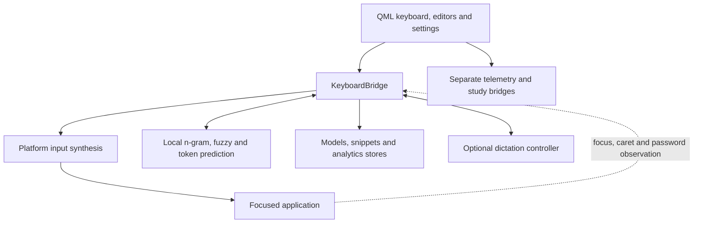

# Architecture review, 10 September 2026

Reviewed the clean working tree at `87f519a`. This is a dated assessment,
not a description of changes already implemented. Recommendations below
are proposals; the review does not change runtime behavior.

**Keep the Python/PySide6 architecture and improve its boundaries in small
steps.** The platform adapters, local prediction engines and QML components
are useful separations. The main weaknesses are concentrated in operation
failure handling and the ownership of interaction state. Those matter
especially here: an incorrect success assumption can affect the next text
replacement, and an unresponsive keyboard removes the user's input device.

The feedback edge is fundamental. The keyboard reconstructs context in
another application without owning its text buffer. It therefore needs
explicit rules for when that reconstructed state is trustworthy.

The current bridge is 5,835 lines; `Main.qml` is 5,192 and
`UnifiedSettingsPanel.qml` is 3,092. These are physical line counts including
comments and blank lines, not complexity scores. They locate the
concentration of responsibilities rather than establish a reason to rewrite.

There are strong foundations to preserve: centralized modifier and verbatim
insertion helpers, explicit window nonactivation, privacy-triggered context
scrubbing and dictation cancellation, separate base and personal prediction
data, hardened archive allow-lists, shared atomic file replacement, and real
QML tests alongside property tests. CI runs tests on Windows and Linux and
checks Python types for both platforms. The earlier structural review's
floating-window extraction, atomic writes, shared pack-ID rules, telemetry
extraction and platform-window extraction have already landed. The C++ branch
is explicitly parked.

1. **Immediate: extend the privacy boundary through platform diagnostics.**

   In [`linux.py`](../../src/platform/linux.py), `_run` logs the complete
   subprocess command on timeout or exception. `send_text` puts input text
   into that command. Privacy mode intentionally permits typing, so it
   cannot prevent these error logs from containing password characters or
   inserted phrases.

   An isolated probe replaced `subprocess.run` with a timeout and captured
   the logger call. The rendered error contained the synthetic input text.
   No real input was sent.

   Define diagnostics at the adapter boundary as backend name, operation
   type, duration and safe error code. Exclude payloads and exception strings
   that can contain command arguments. Add timeout and exception regressions
   that assert a synthetic secret never reaches logging. This is a confirmed
   defect with a small, independently shippable fix.

2. **Immediate, then incremental: give operations honest success and failure contracts.**

   Three boundaries currently lose information their callers need:

   - Input: [`KeySynthesizerBase`](../../src/platform/base.py) returns `None`.
     Linux ignores nonzero subprocess exit status and swallows timeouts;
     Windows `_inject` logs incomplete `SendInput` submission without
     reporting it upstream. `_press_char` then advances the bridge context.
     A later completion can therefore operate on text that was never sent.
   - Persistence: [`SnippetStore.save`](../../src/snippets.py) catches
     `OSError`; mutators update memory and return `True` anyway. A mocked
     write failure confirmed that `set` reports success and changes the live
     value, even though persistence failed.
   - Release: [`build/windows/build.py`](../../build/windows/build.py)
     `main` ignores the Boolean results of `sign_installer` and
     `verify_build`. A fully mocked build with both returning `False` still
     returned exit code 0 and printed that all outputs were signed. The
     updater independently verifies downloads, so this finding establishes
     misleading build success, not an updater signature bypass.

   First make failed installer signing or verification fail the release
   command, and make snippet persistence failure reach the editor. Keep
   intentional unsigned development builds explicit. Then introduce a small
   input result distinguishing submitted, rejected and partial/uncertain.
   On known failure, stop dependent edits, invalidate uncertain context and
   suppress associated learning and success metrics. Never automatically
   replay partial input.

   Successful submission cannot prove the destination application accepted
   the text. Microsoft's [SendInput contract](https://learn.microsoft.com/en-us/windows/win32/api/winuser/nf-winuser-sendinput)
   reports events inserted into the input stream. Preserve that distinction
   in the interface. Each subsystem can use a small domain-specific result;
   a universal command framework is unnecessary.

3. **Next: make restoring user data a transaction across the whole dataset.**

   [`import_user_data`](../../src/data_export.py) replaces model files one
   by one, removes existing packs before extracting their replacements,
   and continues if the rescue export fails. Individual file replacement is
   atomic, but the import as a whole is not. A failure after an earlier
   replacement can leave a mixture of old and imported data. Some pack
   extraction errors are logged and skipped while import returns its summary.

   Stage and validate all payloads before changing live files, including ZIP
   integrity, store parsing and imported snippet newline normalization.
   Require a successful rescue before destructive replacement. Introduce a
   rollback journal or another explicit commit mechanism for the set of
   stores. Parse replacement model state separately and publish it only
   after validation succeeds.

   Add fault injection between file replacements and during pack extraction.
   The required outcome is either a completed restore or a preserved,
   recoverable prior state, with accurate UI status. Preserve every existing
   containment and size check. This recommendation does not require changing
   the export schema; any later schema change needs separate alignment.

4. **Next: give interaction state and in-app editing explicit owners.**

   [`KeyboardBridge`](../../src/keyboard_bridge.py) constructs and manages
   input synthesis, prediction, stores, observation timers, update operations
   and dictation. [`keyboard_app.py`](../../src/keyboard_app.py) reaches into
   `bridge._predictor` to compose the study feature. Tests also replace many
   private collaborators. This makes responsibility changes expensive.

   Begin with constructor injection and public, narrow collaborator
   interfaces while keeping the QML-facing bridge stable. Extract peripheral
   update and data-management operations before moving the typing core.
   Establish one owner for typing-context transitions, including focus
   changes, privacy, study capture and input failure.

   The edit route needs an ownership rule too: `setEditMode` is a Boolean,
   and prediction, snippet and key-action editors listen to shared signals.
   The interface does not identify which editor owns input or which caller
   may release it. Use an exclusive edit session or coordinator and test
   overlapping open/close sequences. A duplicate-input interaction was not
   reproduced in this review; this is an ownership risk visible in the API.

   Also make window focus policy explicit per role. Settings omits
   `WindowDoesNotAcceptFocus` in [`Main.qml`](../../qml/Main.qml) and is absent
   from `_wire_floating_windows`, while its API-key field comments assume
   nonactivation and acknowledge missing edit routing. Resolve that
   inconsistency and provide the field's edit route together. Preserve the
   Dashboard's documented permission to take focus. Desktop activation
   behavior was not exercised during this review.

5. **Next: consolidate settings ownership and verify the entire settings path.**

   Persisted values, root properties, panel properties and string-dispatched
   Python calls form a manual protocol across
   [`Main.qml`](../../qml/Main.qml) and
   [`UnifiedSettingsPanel.qml`](../../qml/components/UnifiedSettingsPanel.qml).
   The documented eight-step process for adding a setting describes the
   maintenance cost accurately.

   Introduce one authoritative settings facade with explicit defaults,
   validation, persistence and application of side effects. Migrate one
   category at a time. Retain the existing separate authorities for
   telemetry consent and dictation credentials; central ownership does not
   mean copying those secrets or consent flags into QML settings.

   Extend the real-QML tests to drive each setting through UI dispatch,
   persistence, restart restoration and its backend effect. Existing layout
   and compact-state tests provide a useful base, but do not establish that
   every setting is wired through all layers.

6. **Measure next: budget work on the interaction thread.**

   Linux synthesis blocks synchronously with a two-second timeout per
   command. Windows accessibility probes run synchronously, and the game
   input path deliberately sleeps between key down and key up. These share
   an interaction loop with keyboard feedback and privacy/focus polling.
   A timeout bounds one call, not an entire multi-command insertion.

   Measure click-to-submission latency, event-loop delay and stalled-backend
   recovery with delayed mocks and representative installations. Prediction
   latency alone does not measure keyboard responsiveness. Move slow work
   only after establishing its cost. Qt's
   [performance guidance](https://doc.qt.io/qt-6/qtquick-performance.html)
   supports minimizing blocking I/O and long work on the GUI thread.

   Any input executor must serialize operations, preserve modifier cleanup
   and invalidate stale queued work when the target, privacy or capture
   session changes. Privacy-sensitive actions still need a current check.
   Merely launching each subprocess independently would break ordering.
   No new latency measurements were taken in this review.

7. **Later: give experimental prediction paths an explicit lifecycle and cost.**

   [`HybridPredictor`](../../src/prediction/hybrid_predictor.py) still trains,
   loads and saves PPM while excluding its candidates from the shipped merge.
   That is an intentional investment in a possible future consumer, with
   ongoing startup, memory, save and maintenance costs. Measure those costs
   and record a decision to retain it for a concrete experiment or retire
   background training while preserving saved-data compatibility.

   The optional transformer path is disabled by the shipping bridge. Keep
   its concurrency and lifecycle work lower priority than the active input
   path. Any revival needs explicit load/cancel/shutdown ownership and
   stale-result rejection. Use the existing held-out AAC benchmarks to
   justify prediction changes and name the corpus with every result. Keep
   the shipped rank-merge default and personal-learning invariants intact.

The practical sequence is: redact diagnostics and fix false success reports;
add input failure results and transactional restore; establish edit and
settings ownership; then use measurements to decide concurrency and
experimental-model work. Preserve sequence tests for modifiers, literal
insertion, privacy, focus changes and capture while introducing each seam.

Validation consisted of source and test inspection, current-tree line
counts, and three isolated mocked probes for Linux log disclosure, build
false success and snippet false success. The successful probes mocked input
submission, build operations and snippet persistence. The full test suite, a signed build,
live desktop interaction and production model data were not exercised.
Only this review and its documentation-index entry were added.
