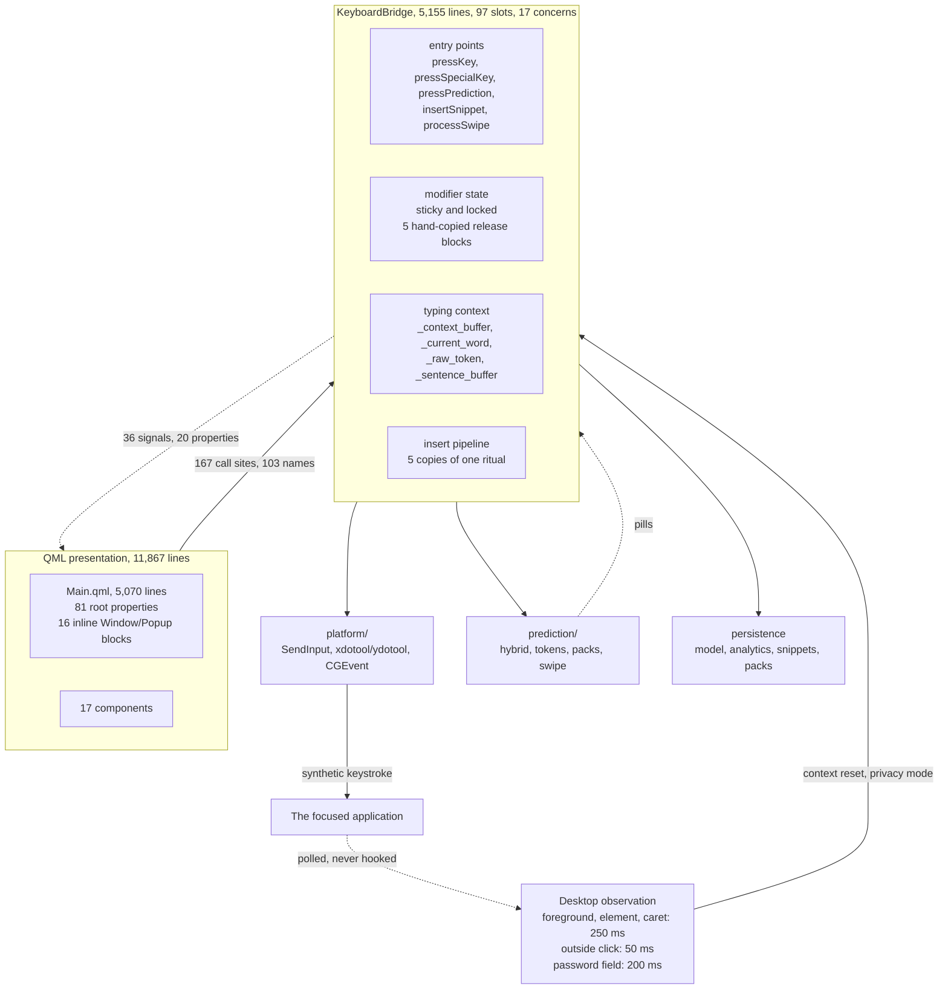
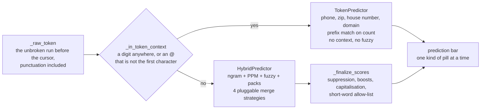

# Structural review

A whole-repository architecture review, taken at **v1.2.2** against `main`
at `7d69557`, 1 September 2026. Every figure below was counted from the
tree rather than estimated, and every claim was checked against the code
on this branch. Line references will drift; symbol names will not, so
findings name symbols wherever one exists.

This is a snapshot, not a standing contract. It records what the structure
costs today and which cuts are worth making, so that a later reader can
tell which of these were acted on and which were declined on purpose.
`docs/architecture/GOTCHAS.md` remains the document about *invariants*;
this one is about *shape*.

---

## 1. The shape of the system

The system is an hourglass. The layers below the waist are genuinely well
separated, almost all of them Qt-free and testable headless. The layer
above it is componentised. Everything passes through two files.



The feedback edge is the part that is easy to miss and expensive to
forget. Because the window carries `WS_EX_NOACTIVATE` and can never hold
focus, the bridge is never *told* what happened in the other application.
It reconstructs it by polling, and those six signals collapse into one
decision: discard the typing context, or stop learning entirely. That is
the price of the property that makes the keyboard usable at all, and it is
where a large share of the bridge's complexity lives.

### The suggestion fork

The second mechanism worth drawing is the choice between the two
suggestion bars, because they are mutually exclusive rather than ranked
against one another.



While the user is part-way through `owen@gm` or `555-123-`, no English
word is a plausible completion, so the bridge picks a producer rather than
merging their output. A tapped pill then inserts differently depending on
which side produced it, and on whether the target application is one that
intercepts keystrokes.

---

## 2. What the measurements say

| Measure | Value |
|---|---|
| Python | 19,871 lines |
| QML | 11,867 lines |
| Tests | 21,291 lines, 1,418 test functions |
| `keyboard_bridge.py` | 5,155 lines, 97 slots, 36 signals, 20 properties |
| `Main.qml` | 5,070 lines, 81 root properties, 16 inline windows and popups |
| QML to bridge contract | 167 call sites over 103 distinct names |
| Test references to bridge privates | 750 |
| Python exempt from mypy | 3,001 lines, 15.1% of `src/` |
| Functions over 100 lines | 18 of 643 |

The last row matters for framing. This is not a codebase of sprawling
functions. The two longest are `pressSpecialKey` (367 lines) and
`_press_char` (338), both in the bridge, both on the keystroke path. The
pathology is concentrated, not diffuse, which is what makes it tractable.

---

## 3. Findings

Ranked by what each costs per future change rather than by how alarming it
sounds. None of these is a live defect: shipped behaviour is guarded
unusually well. These are the places where the structure charges rent.

### 3.1 The bridge cannot be refactored at today's price, and the tests are why

`KeyboardBridge` carries seventeen distinct concerns in one `QObject`:
keystroke synthesis, modifier state, context buffers, prediction and token
orchestration, snippets, glyphs, privacy polling, telemetry, data export,
auto-update, vocabulary packs, analytics, swipe, compatibility and game
detection. Its `__init__` is 334 lines assigning 69 flat attributes and
four timers.

That alone would be ordinary god-object debt. What makes it expensive is
the second number: **750 references to `bridge._...` across the test
suite**, frequently as *setup* rather than assertion. Renaming an internal
field is a test-suite migration, so the cost of any decomposition is paid
twice.

**Seam.** Do not start with the keystroke core, which is genuinely hard and
genuinely correct. Start with the bolt-on feature surfaces (telemetry,
data export, auto-update, vocabulary packs) that already delegate to their
own backing objects. Register those as separate QML context properties in
`keyboard_app.py` and move their pass-through slots off the bridge one
subsystem at a time. Each move is mechanical and independently shippable.

### 3.2 Parallel blocks are the dominant defect generator

`CLAUDE.md` names this failure mode three separate times, and the project
has shipped real bugs from it repeatedly. Sticky-modifier auto-release
exists in **five** hand-written copies (the edit-mode intercept, the chord
branch, the `_press_char` tail, `_release_edit_chord_modifiers`, and the
`pressSpecialKey` tail), and the docs only say so in two places: the
*Sticky Modifiers* section counts four, and *Editing a Prediction* names
`_release_edit_chord_modifiers` as the fifth on its own. The verbatim-insert ritual (release sticky, settle
the owed space, spend the pending auto-cap, send inside the held-modifier
guard, reset five buffers) is repeated across five call sites, with only
`_release_sticky_modifiers()` ever actually extracted.

The same shape appears in persistence, where it has already caused drift:

```
src/prediction/vocabulary_pack.py:28   ^[a-z0-9][a-z0-9_\-]{0,63}$
src/data_export.py:92                  ^[a-z0-9_-]{1,64}$
```

Two definitions of the same security rule, disagreeing about whether a
pack id may begin with a hyphen or an underscore. `_is_reserved_device_name`
is likewise a second independent copy.

**Seam.** Two extractions are worth more than any amount of further
commentary: `_release_modifiers(names, keep=...)`, parameterised on the
exception set, and `_commit_verbatim_insert(text)` owning the whole ritual.
Then one module owning the pack-id regex and the device-name check, imported
by both callers. The existing `_token_pill_words` membership guard is the
model to copy: it makes the wrong thing structurally impossible rather than
requiring every site to remember.

### 3.3 Main.qml holds whole floating windows inline

5,070 lines, 81 root-level properties, 16 inline `Window` or `Popup`
blocks. The Snippets window is roughly 1,200 lines, self-contained, with
its own paging, actions sheet and editor state, reaching back into `root`
only for theme helpers and the desktop clamp. Seven toast popups repeat the
same 40-line shape.

Settings wiring is the other half: 29 persisted settings, a string
dispatcher of 26 branches, and a single setting name appearing up to 40
times across `qml/` and `src/`. The documented eight-step ritual for adding
a setting is the symptom, not the cause.

**Seam.** The floating windows move to their own files with almost no
thought, which is the highest ratio of relief to risk anywhere in this
repository. Then a `ToastPopup.qml` for the seven toasts. The settings
dispatcher can become a declarative table driving both the persistence
block and the bridge call, collapsing four of the eight steps.

### 3.4 The irreplaceable file is the one written non-atomically

Of the five stores written outside the import path, exactly one uses
tempfile-then-rename: `snippets.json`. The learned model, the PPM model,
lifetime analytics and telemetry state all write straight through
`open(path, "w")`.

Every loader carefully rejects a corrupt file, but a plain write
interrupted by a crash or a power loss is precisely how that corrupt file
comes to exist, and the model is the artifact the whole product exists to
accumulate. A user can re-enter their snippets in ten minutes. They cannot
re-type a year of learned vocabulary.

| Store | Written | Atomic |
|---|---|---|
| `snippets.json` | on every edit | yes |
| `ngram_model.json` | on quit, auto-save, manual save | no |
| `ppm_model.json` | on quit, auto-save, manual save | no |
| `analytics.json` | on quit | no |
| `telemetry.json` | on consent change and submit | no |

Underneath that sit six independent hand-rolled implementations of the same
"stat, cap, parse, coerce, fall back" sequence. The fallbacks genuinely
differ per store, which is what has blocked unification; the stat and
size-check boilerplate does not differ at all.

**Seam.** Lift the pattern already written in `snippets.py` into
`atomic_write_json(path, data)` and route the other four through it.
Separately, a `safe_json_load(path, max_bytes) -> dict | None` that leaves
the fallback to the caller collapses six copies of the boilerplate without
touching the differing semantics.

### 3.5 15% of the Python is exempt from the gate CI runs twice

Three modules carry a blanket `ignore_errors = true` in `pyproject.toml`:
`platform/windows.py`, `platform/linux.py` and `keyboard_app.py`, together
3,001 lines. The justification is `ctypes.windll`, and it is a real one,
but it applies to roughly a third of `keyboard_app.py`. The other two
thirds (logging setup, the log purge, the singleton lock, the tray, and the
whole composition root in `main()`) lose type checking as collateral, in a
file whose startup ordering constraints are enforced only by comments.

**Seam.** Move the OS-specific window code into `platform/windows_window.py`
and `platform/macos_window.py`, mirroring the split that already exists for
key synthesis. That re-admits the composition root to mypy and fixes a
second problem at the same time: window styling and activation are
currently a whole OS-abstraction layer living entirely outside the package
named for it.

### 3.6 Cross-boundary contracts are restated rather than shared

Four instances of one shape, all currently consistent, none mechanically
enforced.

- The installer asset name is an f-string in `build/windows/build.py` and a
  regex in `updater.py`. Nothing cross-checks them, so a drift stops
  auto-update silently and only in the field.
- `check.py` and `.github/workflows/ci.yml` maintain independent command
  lists, kept aligned by cross-referencing comments.
- The three build pipelines duplicate their console helpers, lockfile and
  SBOM emission, and Qt exclusion lists, and have already drifted in
  artifact naming.
- The telemetry payload is defined once in Python and again in TypeScript,
  caps included. This is standard for a client and worker split, but it is
  the one contract in the repository with no shared schema at all.

**Seam.** The asset name is the one with real teeth: a shared constant, or
failing that a test asserting the builder's output matches the updater's
pattern. A `build/_shared.py` handles the pipeline duplication.

### 3.7 856 lines that nothing can reach

`qml/components/SettingsPanel.qml` (178) and
`qml/components/PredictionSettingsPanel.qml` (439) are registered in
`qmldir` but never instantiated; only `Comp.UnifiedSettingsPanel` is.
`src/prediction/transformer_predictor.py` (239) defaults on in
`HybridPredictor.__init__`, but `keyboard_bridge.py` constructs it with
`enable_llm=False`, and `torch` and `transformers` are commented out of
`requirements.txt`. It is also the one module in `src/` with no test
coverage.

`src/prediction/autocorrect.py` looks similar from the outside and is
**not** dead: it is live on the autocorrect suggestion path. Worth knowing
before a cleanup pass.

**Seam.** Delete the two panels. For the transformer, either delete it or
put it behind an explicit experimental flag. The current state reads as
reachable surface on every search, which is what makes dead code cost more
than its line count.

### 3.8 The most-trusted document has drifted from the code

`CLAUDE.md` is the project's real design record and is unusually good at
it, which is exactly why its drift matters more than ordinary
documentation rot. It is the artifact read first, by people and by
assistants. The specific contradictions are listed in section 4.

The structural version of this finding is worth stating separately:
a good deal of `CLAUDE.md` exists because the invariants it describes
**cannot be expressed anywhere else**. The five modifier-release blocks are
documented at length precisely because nothing enforces them. Findings 3.1
and 3.2 would take that load off prose and put it in code, which is the
only durable fix.

---

## 4. Claims contradicted by the code

Each verified against the working tree and the live repository
configuration on 1 September 2026.

| Where | Claim | Actual |
|---|---|---|
| `SECURITY-EXCEPTIONS.md` | "`main` has no branch-protection rule", skipped because "solo-dev private repo" | The repository is public, and protection is configured with four required checks (Lint, Type Check, Tests, OSV Scanner). The entry's own stated revisit trigger has fired. |
| `CLAUDE.md` | "mirrored 1:1 in C++", stated as present fact | No C++ files are tracked on `main`. The rewrite lives on `cpp-rewrite`. `docs/architecture/BACKEND_PARITY.md` says so; `CLAUDE.md` never does. |
| `CLAUDE.md` | "1576 tests" in one section, "~1300" and "~1600" in others | 1,418 test functions on `main`. The three figures also contradict one another. |
| `TODO.md` | Phase 3 "Hybrid n-gram + DistilGPT-2 LLM" | The LLM path is constructed disabled and unreachable. The unchecked "Emoji and symbol panels" item beside it is accurate: that window exists only on an open branch. |
| `docs/architecture/BACKEND_PARITY.md` | Parity "verified mechanically by `tests/conformance/`" | `test_cross_backend_parity` skips unless `ALPHA_OSK_CPP_BIN` is set, and that variable appears nowhere in CI or `check.py`. Only the Python determinism self-check runs. |

---

## 5. What is genuinely well built

Recorded because it is unusual, and because several of these are what make
the findings above safe to act on at all.

- **The domain layer is Qt-free by discipline.** Only `HybridPredictor` and
  `TypingAnalytics` import Qt. Every other predictor, plus snippets,
  glyphs, telemetry, data export and text patterns, is plain Python and
  testable headless. That is what keeps a 21,000-line suite runnable in a
  minute.
- **Merge strategies are actually pluggable.** Four parallel `_score_*`
  methods over shared normalisation, with suppression, boosts and casing
  centralised once in `_finalize_scores` rather than repeated per strategy.
  This is the one part of the engine designed for extension rather than
  grown into.
- **Threat models live in the code.** The defence table in `updater.py` and
  the process-lifetime argument in `_update_relauncher.py` are written
  where the code is. The `CREATE_NO_WINDOW` versus `DETACHED_PROCESS`
  reasoning is evidence-based rather than folklore.
- **The headless QML tests avoid their own documented traps.** Every
  `findChildren` on a Repeater and every `contentWidth` comparison in those
  files is a warning comment, not live code. The discipline is real rather
  than aspirational, which is rare for a documented trap.
- **Property tests enforce the stated invariants.**
  `_user_total == sum(user_vocab.values())` is checked after every
  individual mutation across generated sequences, and the import-hardening
  property is asserted end to end against a canary tree, with a deliberate
  inverse test so that an allow-list rejecting everything cannot pass.
- **CI sharding was engineered, not copied.** Stable-hash sharding that
  correctly avoids salted `hash()`, an `if: always()` aggregator so a
  skipped required check cannot read as pending, and a per-OS coverage
  combine because coverage data records absolute paths. Each choice answers
  a failure that actually happened.
- **Trust boundaries hold at the edge.** Archive members, pack folders,
  `pack.json` metadata and imported snippet values are each sanitised where
  they are read, with allow-list extraction rather than deny-list, and the
  security tests target containment rather than specific payloads.

---

## 6. Recommended sequence

Ordered so that each step is independently shippable and makes the next one
cheaper. Nothing here requires touching the keystroke state machine, which
is the part that is hard, correct, and best left alone.

1. **Extract the floating windows from `Main.qml`.** Mechanical,
   self-contained, roughly 1,700 lines out of the god file. Delete the two
   dead settings panels in the same pass. Low risk, no behaviour change.
2. **Fix the contradicted claims in section 4.** The cheapest item here,
   and it is the file everything else reads first. The
   `SECURITY-EXCEPTIONS.md` entry is the one with a real consequence.
3. **Make the model file write atomically.** Lift the pattern from
   `snippets.py` and apply it to four callers. This protects the one
   artifact a user cannot recreate.
4. **Collapse the two extractable duplicate clusters.** Parameterised
   modifier release, and one verbatim-insert commit. Then the pack-id rule
   into a single module. These are the recurring bug source, and the
   existing tests will hold the behaviour steady while the shape changes.
5. **Move the OS window code into `platform/`.** Re-admits the composition
   root to mypy and puts window styling in the package it belongs to. Two
   problems, one move.
6. **Split one feature surface off the bridge as a proof.** Telemetry or
   data export, each of which already delegates to a backing object and has
   few QML call sites. Do one, measure what the 750 private-attribute test
   references actually cost, then decide whether to continue. This is a
   measurement, not a commitment.
7. **Decide the status of the C++ branch.** Either give the conformance job
   a built binary in CI, or record in `CLAUDE.md` that the branch is
   parked. Either is fine. The costly state is the current one, in which a
   document asserts mechanical verification that nothing performs.


### Status, 2 September 2026

Each step became its own pull request, so that a reader can tell what was
acted on. Numbers are pull requests on `owenpkent/alpha-osk`.

| Step | Where | Note |
|---|---|---|
| 1. Extract the floating windows | #55 | `SnippetsWindow.qml`, `SymbolsWindow.qml`; `Main.qml` 6,004 to 4,338 lines; the two dead panels deleted |
| 2. Fix the contradicted claims | the pull request that added this table | all five rows of section 4 |
| 3. Atomic model write | #57 | `src/atomic_write.py`; all six stores route through it |
| 4. Collapse the duplicate clusters | #56, #59 | one pack-id rule in `src/prediction/pack_ids.py`; `_release_sticky_modifiers(names, keep=)`, `_begin_verbatim_insert`, `_commit_verbatim_insert` |
| 5. OS window code into `platform/` | #61 | `windows_window.py`, `macos_window.py`; `keyboard_app.py` off the mypy ignore list, which surfaced one real error |
| 6. Split one surface off the bridge | #62 | telemetry; the measurement is below |
| 7. Decide the C++ branch | decided 2026-09-02 | parked, not deleted: recorded in `CLAUDE.md` and `BACKEND_PARITY.md`; the conformance harness keeps skipping until a built binary exists, and the branch stays as reference |

**What step 6 measured.** Moving telemetry removed 56 lines from the
bridge and needed one seam, a read-only `analytics` property. The move
itself was mechanical. The expense was elsewhere: seven headless QML
fixtures each registered the `keyboard` context property by hand, so a
second property meant seven edits (now one, through
`tests/qml_context.py`), and the new test module hit a Qt lifecycle flake
(`QTimer.isActive()` reads False with no `QCoreApplication` in the
worker). The private-reference count in the tests did not move for the
bridge, because no bridge test had referenced telemetry. Data export, the
next candidate, is a different bet: six slots, and `importUserData`
reloads the predictor, analytics and snippets and clears the typing
buffers, so expect the one seam to become three or four.

Two things the sequence did not anticipate, both fixed on the way: running
several worktree gates at once collided on the test QSettings scope, which
was keyed only by xdist worker (#58), and four advisories against a
transitive npm dev dependency blocked every pull request on the OSV gate
for an afternoon (#60).

---

## 7. Method

Seven parallel passes over the tree: the bridge, the prediction engine, the
platform layer, the QML layer, persistence, lifecycle and build, and the
test suite and documentation. Counts come from the working tree at
`7d69557`. The inline-window count is the `Window` and `Popup` blocks in
`Main.qml` less the root window; the private-reference count is
occurrences of `bridge._` under `tests/`. Repository visibility and branch protection were read from the
live configuration rather than assumed. Merge-order hazards between
in-flight branches were deliberately left out of this document, because
they expire; findings here are about the structure, which does not.
