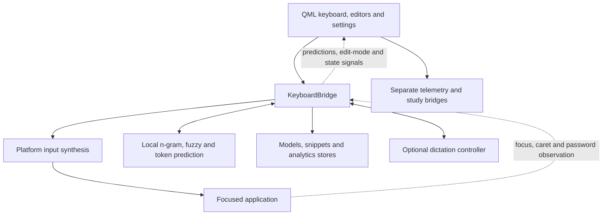

# Architecture review, 10 September 2026

This is a dated assessment, not a description of changes already
implemented. Recommendations below are proposals; the review does not
change runtime behavior. It sits in `research/` for that reason: the
`architecture/` docs describe what `src/` does, and this document is a list
of things it does not do yet.

## What was reviewed

The clean working tree at `87f519a`, which was the head of pull request
[#108](https://github.com/owenpkent/alpha-osk/pull/108) on the day of the
review. That tree is **v1.4.1** (`438cfd3`, the `main` of the day) plus
#108's then-unmerged prediction-engine work in `hybrid_predictor.py`,
`ngram_predictor.py`, `prefix_beam.py` and `fuzzy_recognizer.py`, 963
insertions and 284 deletions across 20 files.

`87f519a` is an exact identifier and a perishable one, in two ways rather
than one. The repository squash-merges, so it will not be reachable from a
fresh clone once #108 lands; and #108's branch has since been revised in
review and force-pushed, so that commit is already off the branch and the
pull request's current head describes a different tree. The durable
identifiers are therefore the tag and the pull request number, and the
anchor that matters is **v1.4.1**: nothing below turns on the unmerged
commits, and the three files whose sizes are quoted differ from v1.4.1 by
one line between them (`keyboard_bridge.py` 5,835 against 5,834; the other
two identical).

This document continues the
[structural review](../architecture/STRUCTURAL_REVIEW.md) of 1 September
2026, which remains the record of its own recommended sequence and carries
the live status table of what landed (#55 to #62). Two of the
recommendations here revisit constraints that review set. Each says so
where it does (items 2 and 4) and gives the reason.

## Verdict

**Keep the Python/PySide6 architecture and improve its boundaries in small
steps.** The platform adapters, local prediction engines and QML components
are useful separations. The main weaknesses are concentrated in operation
failure handling and the ownership of interaction state. Those matter
especially here: an incorrect success assumption can affect the next text
replacement, and an unresponsive keyboard removes the user's input device.

Both edges between the UI and the bridge carry weight. QML calls slots;
Python answers with signals, and the edit-mode routing that item 4 depends
on travels along the signal edge. The feedback edge from the focused
application is fundamental for a different reason: the keyboard
reconstructs context in another application without owning its text
buffer, so it needs explicit rules for when that reconstructed state is
trustworthy.

## Measurements

The bridge is 5,835 lines; `Main.qml` is 5,192 and
`UnifiedSettingsPanel.qml` is 3,092. These are physical line counts
including comments and blank lines, not complexity scores. They locate the
concentration of responsibilities rather than establish a reason to
rewrite. The structural review's status table puts `Main.qml` at 6,004
before its floating-window extraction and 4,338 after it (#55), so 5,192 is
about 850 lines of regrowth since 2 September rather than a bare number.

## Foundations to preserve

Centralized modifier and verbatim insertion helpers, explicit window
nonactivation, privacy-triggered context scrubbing and dictation
cancellation, separate base and personal prediction data, hardened archive
allow-lists, shared atomic file replacement, and real QML tests alongside
property tests. CI runs tests on Windows and Linux and checks Python types
for both platforms. The structural review's floating-window extraction,
atomic writes, shared pack-ID rules, telemetry extraction and
platform-window extraction have already landed. The C++ branch is
explicitly parked.

## 1. Immediate: extend the privacy boundary through platform diagnostics

Two sites in [`linux.py`](../../src/platform/linux.py) write typed content
to the log at a level that reaches `alpha-osk.log`. `_run` logs the
complete subprocess command at ERROR on timeout and on any other exception,
and `send_text` builds that command as `xdotool type --clearmodifiers --
<text>`, so on a host where xdotool stalls the log records the characters
typed. `send_key` logs the key name at WARNING when no synthesis tool is
installed, and the chord path in `_press_char` hands it the typed letter,
so a host with neither xdotool nor ydotool records every chorded letter.
Privacy mode intentionally permits typing, so it cannot prevent either
record from containing password characters or inserted phrases.
[`CLAUDE.md`](../../CLAUDE.md) makes this a hard invariant (no record at
INFO or above may interpolate typed content), and the log is the file users
attach to bug reports.

An isolated probe replaced `subprocess.run` with a timeout and captured the
logger call. The rendered error contained the synthetic input text. No real
input was sent.

The defect is the level, not the presence of payloads in the platform
layer. The prediction path logs candidate words at DEBUG, and
`keyboard_app.py::_configure_logging` records that as policy: DEBUG is the
sanctioned place for typed content because it is off in normal operation.
Leave those sites alone. At ERROR and WARNING, define diagnostics at the
adapter boundary as backend name, operation type, duration and a safe error
code; exclude payloads and exception strings that can carry command
arguments. Add timeout, exception and missing-tool regressions that assert
a synthetic secret never reaches a record at INFO or above.

The fix has an established second half. `keyboard_app.py::_purge_pre_fix_logs`
and its `.log-privacy-purge` sentinel exist because fixing the logging sites
only stops new leakage, while an upgrading user still holds up to four
rotated files. A Linux host that hit either site has those transcripts on
disk now. The existing purge runs once and its sentinel is already present
on every upgraded install, so the redaction ships with a second, separately
guarded purge. This is a confirmed defect with a small fix that stands on
its own; it should be its own pull request rather than wait on anything
else in this document.

**Fixed in [#120](https://github.com/owenpkent/alpha-osk/pull/120)**, which
redacted both Linux sites and the macOS sibling and added the second purge
generation for Linux and macOS. It is recorded here because a dated
assessment that never says which of its findings were acted on is worth
less at every later reading; the rest of this document remains proposals.

## 2. Immediate, then incremental: give operations honest success and failure contracts

Three boundaries currently lose information their callers need:

- Input: [`KeySynthesizerBase`](../../src/platform/base.py) returns `None`.
  Linux ignores nonzero subprocess exit status and swallows timeouts;
  Windows `_inject` logs incomplete `SendInput` submission without
  reporting it upstream. `_press_char` then advances the bridge context.
  A later completion can therefore operate on text that was never sent.
- Persistence: [`SnippetStore.save`](../../src/snippets.py) catches
  `OSError`; mutators update memory and return `True` anyway. A mocked
  write failure confirmed that `set` reports success and changes the live
  value, even though persistence failed.
- Release: [`build/windows/build.py`](../../build/windows/build.py) `main`
  ignores the Boolean results of `sign_installer` and `verify_build` on the
  full-build path. The `--verify-only` branch is correct and already
  returns `verify_build`'s result as the exit code; the defect is on the
  path that produces a release. A fully mocked full build with both
  returning `False` still returned exit code 0 and printed that all outputs
  were signed. The updater independently verifies downloads, so this
  finding establishes misleading build success, not an updater signature
  bypass.

The [structural review](../architecture/STRUCTURAL_REVIEW.md) section 6
set a constraint this item revisits: nothing in that sequence touches the
keystroke state machine, "the part that is hard, correct, and best left
alone". That was the right rule for a structural clean-up and it still
governs refactoring for shape. The input result is a correctness change,
argued from a reproduced failure path rather than from structure: the state
machine advances on a send that may not have happened. The work is staged
so the constraint gives way only where the evidence does.

First make failed installer signing or verification fail the release
command, and make snippet persistence failure reach the editor. Neither
touches `_press_char`. Keep intentional unsigned development builds
explicit. Then, with sequence tests for modifiers, literal insertion,
privacy and capture written first so the machine's current behavior is
pinned, introduce a small input result distinguishing submitted, rejected
and partial/uncertain. On known failure, stop dependent edits, invalidate
uncertain context and suppress associated learning and success metrics.
Never automatically replay partial input.

Successful submission cannot prove the destination application accepted
the text. Microsoft's [SendInput contract](https://learn.microsoft.com/en-us/windows/win32/api/winuser/nf-winuser-sendinput)
reports events inserted into the input stream. Preserve that distinction
in the interface. Each subsystem can use a small domain-specific result;
a universal command framework is unnecessary.

## 3. Next: make restoring user data a transaction across the whole dataset

[`import_user_data`](../../src/data_export.py) replaces model files one by
one, removes existing packs before extracting their replacements, and
continues if the rescue export fails. Individual file replacement is
atomic, but the import as a whole is not. A failure after an earlier
replacement can leave a mixture of old and imported data. Some pack
extraction errors are logged and skipped while import returns its summary.

Stage and validate all payloads before changing live files, including ZIP
integrity, store parsing and imported snippet newline normalization.
Introduce a rollback journal or another explicit commit mechanism for the
set of stores. Parse replacement model state separately and publish it only
after validation succeeds.

Requiring a successful rescue before destructive replacement is the
natural precondition, and it reverses a recorded choice: the function's
own docstring says rescue export failures are logged but do not abort the
import. The cost of reversing it is storage. A rescue is a second full copy
of the dataset and a staging area is a third, so on a disk that cannot hold
them a hard precondition means the user can no longer restore the one
artifact `CLAUDE.md` calls irreplaceable. So make the failure visible and
the choice the user's: report that the rescue could not be written and
why, and let them proceed without one deliberately, rather than either
aborting or continuing in silence as today. State the space cost in the UI
when it is the reason.

Add fault injection between file replacements and during pack extraction.
The required outcome is either a completed restore or a preserved,
recoverable prior state, with accurate UI status. Preserve every existing
containment and size check. This recommendation does not require changing
the export schema; any later schema change needs separate alignment.

## 4. Next: give interaction state and in-app editing explicit owners

[`KeyboardBridge`](../../src/keyboard_bridge.py) constructs and manages
input synthesis, prediction, stores, observation timers, update operations
and dictation. [`keyboard_app.py`](../../src/keyboard_app.py) reaches into
`bridge._predictor` to compose the study feature. Tests also replace many
private collaborators. This makes responsibility changes expensive.

The [structural review](../architecture/STRUCTURAL_REVIEW.md) section 3.1
found that the bridge cannot be refactored at today's price because 750
test references to its private attributes make every decomposition a test
migration, and its step 6 (splitting telemetry off, #62) was "a
measurement, not a commitment". This item reads that measurement and
proposes the next step rather than overriding it. Constructor injection
changes no attribute name and no QML slot, so it is the one seam that does
not pay the migration cost, and it is what lets the peripheral extractions
follow the telemetry pattern.

Begin there: constructor injection and public, narrow collaborator
interfaces while keeping the QML-facing bridge stable. Extract peripheral
update and data-management operations before anything in the typing core,
which this item does not propose moving. Establish one owner for
typing-context transitions, including focus changes, privacy, study
capture and input failure. That owner is a rule about who may call the
reset and when, not a relocation of the reset.

The edit route needs an ownership rule too: `setEditMode` is a Boolean,
and prediction, snippet and key-action editors listen to shared signals.
The interface does not identify which editor owns input or which caller
may release it. Use an exclusive edit session or coordinator and test
overlapping open/close sequences. A duplicate-input interaction was not
reproduced in this review; this is an ownership risk visible in the API.

Also make window focus policy explicit per role. In
[`Main.qml`](../../qml/Main.qml), Settings (`settingsWindow`), Help
(`helpWindow`) and the Dashboard (`vizWindow`) all declare the same flag
set with no `WindowDoesNotAcceptFocus`, and none of the three is given
`WS_EX_NOACTIVATE` by `_wire_floating_windows`, which covers Snippets,
Symbols and Study. The Dashboard's permission to take focus is documented
and should be preserved. Settings is inconsistent with itself: its API-key
field comments assume nonactivation and acknowledge the missing edit route.
Help has no recorded decision at all, and it is the window a user opens
while typing into another application, so it is the one most worth one.
Resolve the inconsistency and provide the Settings field's edit route
together. Desktop activation behavior was not exercised during this review.

## 5. Next: consolidate settings ownership and verify the entire settings path

Persisted values, root properties, panel properties and string-dispatched
Python calls form a manual protocol across
[`Main.qml`](../../qml/Main.qml) and
[`UnifiedSettingsPanel.qml`](../../qml/components/UnifiedSettingsPanel.qml).
The documented eight-step process for adding a setting describes the
maintenance cost accurately.

Introduce one authoritative settings facade with explicit defaults,
validation, persistence and application of side effects. Migrate one
category at a time. Retain the existing separate authorities for telemetry
consent and dictation credentials; central ownership does not mean copying
those secrets or consent flags into QML settings.

Extend the real-QML tests to drive each setting through UI dispatch,
persistence, restart restoration and its backend effect. Existing layout
and compact-state tests provide a useful base, but do not establish that
every setting is wired through all layers.

## 6. Measure next: budget work on the interaction thread

Linux synthesis blocks synchronously with a two-second timeout per
command. Windows accessibility probes run synchronously, and the game
input path deliberately sleeps between key down and key up. These share
an interaction loop with keyboard feedback and privacy/focus polling.
A timeout bounds one call, not an entire multi-command insertion.

Measure click-to-submission latency, event-loop delay and stalled-backend
recovery with delayed mocks and representative installations. Prediction
latency alone does not measure keyboard responsiveness. Move slow work
only after establishing its cost. Qt's
[performance guidance](https://doc.qt.io/qt-6/qtquick-performance.html)
supports minimizing blocking I/O and long work on the GUI thread.

Any input executor must serialize operations, preserve modifier cleanup
and invalidate stale queued work when the target, privacy or capture
session changes. Privacy-sensitive actions still need a current check.
Merely launching each subprocess independently would break ordering.
No new latency measurements were taken in this review.

## 7. Later: measure what the retained PPM training costs

[`HybridPredictor`](../../src/prediction/hybrid_predictor.py) still trains,
loads and saves PPM while excluding its candidates from the shipped merge.
The merge decision is already recorded in `CLAUDE.md`: `_ppm_in_merge`
defaults to False, the merge cost was measured (21 ms to 3 ms per
keystroke), and training is retained for a possible later fusion inside
the prefix beam. What is not measured is the cost of the training that
remains: startup load, resident memory, save time and the size of
`ppm_model.json` on a matured model. Measure that, and record either a
concrete experiment the trained model is being kept for or a decision to
retire background training while preserving saved-data compatibility.

The optional transformer path is disabled by the shipping bridge. Keep
its concurrency and lifecycle work lower priority than the active input
path. Any revival needs explicit load/cancel/shutdown ownership and
stale-result rejection. Use the existing held-out AAC benchmarks to
justify prediction changes and name the corpus with every result. Keep
the shipped rank-merge default and personal-learning invariants intact.

## Sequence

Redact diagnostics and fix false success reports; add input failure
results and transactional restore; establish edit and settings ownership;
then use measurements to decide concurrency and experimental-model work.
Preserve sequence tests for modifiers, literal insertion, privacy, focus
changes and capture while introducing each seam.

## Method and limits

Validation consisted of source and test inspection, current-tree line
counts, and three isolated mocked probes for Linux log disclosure, build
false success and snippet false success. The successful probes mocked input
submission, build operations and snippet persistence. The full test suite,
a signed build, live desktop interaction and production model data were
not exercised. Only this review and its documentation-index entries were
added.
